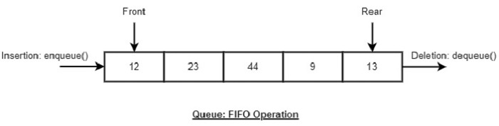

# Collection Framework

### Collection Framework

java에서 **데이터를 저장**하는 자료구조와 **데이터 처리** 알고리즘을 구조화, 구현한 것.\
인터페이스와 다형성을 이용한 객체지향적 설계로 편리하고 재사용성이 높다.\
jvm에 맞추어 최적화가 잘되어있다.\
기본타입은 사용하지못하고 객체타입을 사용해야한다(null 포함).

#### Collection Framwork 구조

<figure><figcaption></figcaption></figure>

#### Iterable

컬렉션 프레임워크의 최상의 인터페이스. 자료들을 순회할때 사용하는 Iterator객체를 관리하는 인터페이스.

#### Collection

List, Queue, Set을 상속하는 인터페이스.

### List

저장 **순서가 유지**되는 컬렉션.\
중복 저장 허용.\
배열과 다르게 **크기를 동적**으로 늘리고 줄인다.\
요소들 사이의 빈공간을 허용하지 않아서 데이터 삭제, 삽입이 일어날때 **배열 이동이 발생**함.

#### Array List

**배열을 사용**하여 만든 리스트\
데이터의 순서가 유지되고 중복을 허용\
배열 **크기를 동적**으로 늘리고 줄임\
단방향 포인터 구조로 요소들의 **순차적 조회가 빠름**

<figure><figcaption></figcaption></figure>

#### Linked List

**노드**(객체)를 사용하여 만든 리스트\
노드에는 다음 노드의 주소, 이전 노드의 주소 등이 포함되어있음\
데이터의 삽입, 삭제 속도가 빠름\
**임의의 요소에 대한 접근이 느림**\
Singly LinkedList, Doubly LinkedList, Circular Doubly LinkedList 등이 있음 자바의 LinkedList는 Doubly LinkedList로 되어있음

<figure><figcaption>
Doubly LinkedList
</figcaption></figure>

#### Vector

ArrayList의 구형버전\
모드 메소드가 Synchronized 선언되어있어 **thread-safe**하다

#### Stack

Last In First Out 형태의 구조

### Queue

First In First Out 형태의 구조

<figure><figcaption></figcaption></figure>

#### PriorityQueue

일반적인 큐와는 다르게 **요소에 우선순위**를 매기는 방식\
우선순위가 높은것 부터 사용\
우선순위 비교를 위해 Comparable을 구현

### DeQue

양쪽으로 데이터를 삽입, 삭제가 가능한 방식\
스택과 큐를 합쳐놓은 것 같아 스택으로 사용하거나 큐로 사용할수있음

#### ArrayDeque

스택으로 사용할땐 stack클래스보다 빠름, 대기열로 사용할땐 LinkedList보다 빠름

### Set

데이터의 **중복을 허용하지 않고** **순서를 유지하지 않는** 컬렉션

#### HashSet

배열과 연결 노드를 결합한 구조\
가장 빠른 임의 검색 접근 속도\
추가, 삭제, 검색, 접근이 모두 뛰어남

<figure><figcaption>
데이터를 해싱 후 저장
</figcaption></figure>

#### LinkedHashSet

순서를 가진 Set

#### TreeSet

이진 트리 형식으로 데이터를 저장\
데이터를 정렬하여 저장한다\
정렬, 검색, 범위 검색이 빠름

#### Map

**key, value** 쌍으로 이루어진 데이터들의 집합\
value는 중복가능하지만 key는 중복 불가능

* Map.Entry\
  key, value를 가진 node 클래스가 구현하는 인터페이스

#### HashMap

HashTable을 보완한 컬렉션\
배열과 연결이 결합되어 Hashing형태로 key, value를 묶어서 하나의 데이터로 저장\
중복을 허용하지않고 순서도 없음\
데이터의 추가, 삭제, 검색, 접근 모두 뛰어남\
기본적으로 비동기이기 때문에 ConcurrentHashMap으로 동기적으로 작동하는 HashMap사용가능

#### LinkedHashMap

데이터의 순서를 보장하는 기능이 추가된 HashMap\
저장된 순서대로 순서를 가짐

#### TreeMap

이진 트리 형식으로 데이터를 저장\
범위 검색이 가능하다\
저장과 정렬을 동시에 하기때문에 오래걸림

#### HashTable

자바 초기버전의 컬렉션\
Key를 해시 함수로 수행후 결과를 인덱스로 사용하여 데이터를 저장, 검색 함

### 컬렉션 비교

#### ArrayList

* 리스트 구조의 기본
* 임의의 요소 접근 빠름
* 요소의 순차적 추가, 삭제는 빠름
* 요소 추가, 삭제는 느림

#### LinkedList

* 요소 추가, 삭제 빠름
* 임의의 요소 접근 느림
* ArrayList 사용 추천

#### HashMap, HashSet

* 해싱을 사용하여 임의의 요소에 대한 추가, 삭제, 검색, 접근 모두 좋음
* 검색성능 최고(O(1))

#### TreeMap, TreeSet

* 요소 정렬이 필요할 때 사용하는 자료구조
* 범위 검색에 적합

#### LinkedHashMap, LinkedHashSet

* 기존 구조에 저장 순서 유지가 추가됨

#### Queue

* 스택, 큐 구조가 필요하다면 ArrayDeque 사용 추천

***

#### 참고

[https://medium.com/@Emmanuel.A/data-structures-arraylist-239a5b39cd7e](https://medium.com/@Emmanuel.A/data-structures-arraylist-239a5b39cd7e)\
[https://medium.com/itnext/linkedlist-in-swift-code-a-linkedlist-data-structure-in-swift-playgrounds-97fe2ed9b8f1](https://medium.com/itnext/linkedlist-in-swift-code-a-linkedlist-data-structure-in-swift-playgrounds-97fe2ed9b8f1)\
[https://www.tutorialspoint.com/data\_structures\_algorithms/dsa\_queue.htm](https://www.tutorialspoint.com/data\_structures\_algorithms/dsa\_queue.htm)\
[https://www.iunera.com/kraken/fabric/hash-sets-in-data-structures/](https://www.iunera.com/kraken/fabric/hash-sets-in-data-structures/)\
[https://inpa.tistory.com/entry/JCF-%F0%9F%A7%B1-Collections-Framework-%EC%A2%85%EB%A5%98-%EC%B4%9D%EC%A0%95%EB%A6%AC](https://inpa.tistory.com/entry/JCF-%F0%9F%A7%B1-Collections-Framework-%EC%A2%85%EB%A5%98-%EC%B4%9D%EC%A0%95%EB%A6%AC)

