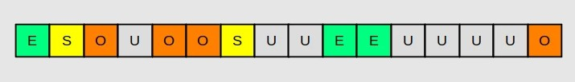

# JVM - Garbage Collection

### GC - Garbage Collection

Jvm(Java Virtual Machine)에서 불필요한 메모리를 자동으로 정리하는 프로세스\
heap 메모리 영역에 필요 없게된 객체를 주기적으로 제거한다.

gc의 필요성은 수동으로 이루어지는 메모리 관리로 인해 발생하는 문제에서 비롯된다.

* 메모리 누수: 할당된 메모리를 해제하는 것을 잊어 버릴 때 발생한다. \
  시간이 지날수록 메모리가 누적되어 애플리케이션에 문제가 발생할 수 있다.
* 댕글링 포인터: 아직 사용 중이거나 사용될 메모리가 조기에 할당 해제된 경우 충돌이 발생하거나 예측할 수 없는 결과가 발생할 수 있다.
* 이중 해제: 이미 할당 해제된 메모리를 다시 할당 해제하려고 할 때 발생하는 문제. 메모리가 손상되거나불규칙한 동작이 발생할 수 있다.

gc 이전에 수동으로 메모리를 관리하던 시절은 위와같은 문제들이 발생할 수 있었다. 이러한 문제들을 해결하고자 자동 메모리 관리 프로세스가 세상에 나왔다.

gc 작동시 gc와 관련된 쓰레드를 제외한 쓰레드들이 멈추는 `Stop-the-world` 가 발생한다.&#x20;

#### Garbage Collector

java는 개발자가 직접 객체의 메모리를 명시하지 않기때문에 Garbage Collector가 사용되지 않는 객체를 찾아 지우는 작업을 한다. 이 Garbage Collector는 두 가지 가정에 의해 만들어 졌는데

> * 대부분의 객체는 금방 접근 불가능 상태가 된다.
> * 오래된 객체에서 젋은 객체로의 참조는 아주 적게 존재한다.

이러한 가정을 통해 Garbage Collector는 효율적으로 메모리를 관리한다.

### Heap 구조

**gc 알고리즘에 따라 heap 메모리를 관리하는 방법이 다양하다.**\
HotSpot Jvm 에서는 heap 메모리 구조를 Young generation과 Old generation 두 물리적 공간으로 구분지어서 gc를 효율적으로 작동하게 한다.

#### Young Generation/Old Generation

* Young Generation: 새로운 객체가 할당되는 영역. eden, survivor 0, survivor 1 영역으로 세분화 된다.
  * eden: `new`를 통해 새로 생성된 객체가 저장되는 영역
  * survivor 0 / survivor 1: 최소 1번 이상 gc에서 살아남은 객체가 저장되는 영역
* Old Generation: young generation에서 여러번의 gc에서 살아남은 객체가 저장되는 영역
* Permanent Generation: 클래스와 메서드 등에 관련된 메타데이터가 저장되는 영역. \
  java 8 이후 heap 영역에서 제거되었다.

<figure><figcaption>
HotSpot Jvm의 Heap 구조
</figcaption></figure>

### GC 방식

#### Mark Sweep

mark sweep 방식은 heap 메모리를 정리하는 기본적인  방법이다. 메모리에서 제거될 객체를 식별하고 제거하는 과정이다.

* Mark: root set(스택, 레지스터, 스태틱 변수)에서부터 그래프 순회를 통해 도달 가능한 객체를 식별한다.
* Sweep: 참조되지 않은 객체들을 heap 메모리에서제거한다.

### Minor GC

young 영역을 정리하기 위한 gc를 칭한다. minor gc는 다음과 같은 절차로 이루어진다.

1. 새로 생성된 객체는 eden 영역에 저장된다.
2. eden 영역에서 도달 가능한 객체를 찾아 식별한다.(mark)
3. eden 영역에서 gc가 발생하면 살아남은 객체들은 survivor 영역 중 한 곳에 저장된다.(copy)
4. 이후 다시 gc가 발생하면 eden 영역과 비어있지 않은 survivor 영역에서 살아남은 객체를 다른 survivor 영역에 저장한다.
5. 과정을 반복하고 일정 연령을 넘긴 객체는 old 영역에 저장된다.

minor gc의 과정에서도 gc 스레드를 제외한 스레드가 멈추는 stop the world가 발생한다. 하지만 아주 짧은 시간에 이루어진다.

### Major GC

old 영역을 정리하기 위한 gc를 칭한다. 기본적으로 old 영역이 가득찬 경우 발생하며 다양한 방법이 존재한다.\
major gc에서의 stop the world는 오랜 시간 걸리기 때문에 이 stop the world 시간을 줄이기 위해 적절한 gc 알고리즘의 선택과 튜닝이 필요하다.

### Garbage Collector

위에서 잠깐 언급 했듯이 효율적인 메모리 관리를 위해 다양한 garbage collector들이 존재한다.

#### Serial GC

단일 쓰레드를 활용하여 minor gc와 major gc를 수행한다. \
mark-compact 방식을 활용하여 old 영역에서 생존한 객체를 heap 메모리의 시작 부분으로 이동시켜 하나의 연속된 메모리 덩어리로 이루어지도록 한다. 이로 인해 메모리의 단편화를 막을 수 있고 메모리 청크를 더 빠르게 할당할 수 있다.

#### Parallel GC

serial gc와 기본 동작은 유사하지만 멀티 쓰레드를 활용하여 minor gc를 수행하기 때문에 stop the world의 시간을 줄일 수 있다.

* Parallel Old GC\
  major gc또한 멀티 쓰레드를 활용할 수 있다. old 영역은 메모리 압축 단계를 거치고 young 영역은 압축이 필요하지 않다.

#### Concurrent Mark Sweep (CMS)

gc 수행을 대부분의 쓰레드와 동시에 수행하여 stop the world의 시간을 단축한다. 객체를 이동하거나 압축하지 않기 때문에 더 큰 용량의 heap 메모리가 필요할 수 있다.

minor gc의 경우 parallel gc와 동일한 방식을 사용한다.

#### G1 GC

cms를 대체하도록 설계된 이 방법은 앞선 gc들과는 매우 다른 배치를 이루고 있어  병렬적이고 동시적이고 점진적으로 압축되는 방식의 gc이다.

g1 gc는 young 영역과 old 영역을 물리적으로 구분 짓는 것이 아닌 지역(region)이라는 개념을 통해 영역과 역할을 동적으로 할당한다. 다른 gc는 eden, survivor, old 영역에 순차적으로 저장됐지만 g1 gc는 효율적인 영역을 판단해 객체를 할당 시킨다.

<figure><figcaption>
O: Old, S: Survivor, E: Eden, U: Unassigned
</figcaption></figure>

다른 gc와 다르게 각 지역을 독립적으로 정리할 수 있고 동일한 지역의 모든 세대를 정리할 필요 없이 원하는 지역의 개수나 조합을 선택할 수 있어 stop the world의 시간을 크게 단축시킬 수 있다.

g1 gc는 병렬로 gc를 수행할 수 있지만 몇몇 단계에서는 stop the world가 발생한다. 그럼에도 불구하고 일반 적으로 다른 gc보다 성능이 뛰어나다.

하지만 g1 gc는 heap 메모리의 크기가 작은 경우 성능이 떨어질 수 있다. heap이 작은 경우 full gc가 발생할 수 있으며 full gc 발생시 효율적이지만 느린 알고리즘을 수행한다.

#### Z GC & Shenandoah GC

z gc와 shenandoah gc는 최신 자바 버전에 도입된 새로운 garbage collector이다. heap 메모리 크기의 상관없이 최대한 적은 시간의 stop the world를 제공하는 gc이다.

### 메모리 관리

분명 gc가 자동으로 메모리를 관리해주지만 애플리케이션의 성능, 안정성, 확장성을 위해 효과적인 메모리 관리가 필요하다. 효과적인 메모리 관리를 위해 java에 대해서 이해하고 지속적인 관심이 필요하다.

***

#### 참고

[https://www.oracle.com/webfolder/technetwork/tutorials/obe/java/gc01/index.html](https://www.oracle.com/webfolder/technetwork/tutorials/obe/java/gc01/index.html)

[https://www.dynatrace.com/news/blog/understanding-g1-garbage-collector-java-9/](https://www.dynatrace.com/news/blog/understanding-g1-garbage-collector-java-9/)

[https://inpa.tistory.com/entry/JAVA-%E2%98%95-%EA%B0%80%EB%B9%84%EC%A7%80-%EC%BB%AC%EB%A0%89%EC%85%98GC-%EB%8F%99%EC%9E%91-%EC%9B%90%EB%A6%AC-%EC%95%8C%EA%B3%A0%EB%A6%AC%EC%A6%98-%F0%9F%92%AF-%EC%B4%9D%EC%A0%95%EB%A6%AC](https://inpa.tistory.com/entry/JAVA-%E2%98%95-%EA%B0%80%EB%B9%84%EC%A7%80-%EC%BB%AC%EB%A0%89%EC%85%98GC-%EB%8F%99%EC%9E%91-%EC%9B%90%EB%A6%AC-%EC%95%8C%EA%B3%A0%EB%A6%AC%EC%A6%98-%F0%9F%92%AF-%EC%B4%9D%EC%A0%95%EB%A6%AC)

[https://d2.naver.com/helloworld/1329?source=post\_page-----2d046f73da4f--------------------------------](https://d2.naver.com/helloworld/1329?source=post\_page-----2d046f73da4f--------------------------------)

[https://medium.com/@AlexanderObregon/understanding-javas-garbage-collection-bc141a2ef31f](https://medium.com/@AlexanderObregon/understanding-javas-garbage-collection-bc141a2ef31f)

